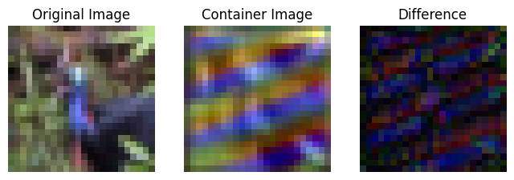
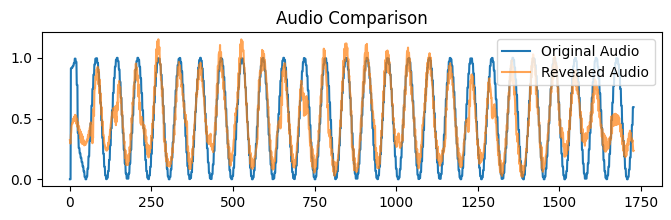

# Deep Audio-into-Image Steganography using Convolutional Neural Networks

This repository contains a miniature implementation of **Deep Neural Network-based Audio-into-Image Steganography**, where short synthetic audio signals are invisibly embedded inside color images using a CNN architecture.  
The project replicates the core idea from the IEEE paper *“Deep Neural Networks based Invisible Steganography for Audio-into-Image Algorithm.”*

---

## Project Overview

- **Goal:** Hide short audio signals inside color images and accurately recover them with minimal distortion.  
- **Method:** Deep learning-based steganography using three CNN modules — **Prepare**, **Hiding**, and **Reveal** networks.  
- **Dataset:** CIFAR-10 (32×32 images) + 100 synthetic sine-wave audio samples.  
- **Framework:** TensorFlow / Keras (Python 3.12).  

---

## Architecture Overview

| Network | Function |
|----------|-----------|
| **Prepare Network** | Extracts useful audio features to be embedded. |
| **Hiding Network** | Combines the cover image and audio features to produce a *container image*. |
| **Reveal Network** | Recovers the hidden audio signal from the container image. |

Each subnetwork uses multi-scale CNN layers (3×3, 4×4, 5×5 filters) to learn hierarchical spatial features.

---

## Implementation Steps

1. **Load CIFAR-10 dataset** and normalize images.  
2. **Generate synthetic audio signals** (sine waves) and reshape them into 2D 32×32×3 tensors.  
3. **Build three CNN sub-networks**:
   - PrepareNet
   - HidingNet
   - RevealNet  
4. **Train** the combined end-to-end model for 5 epochs on 100 image–audio pairs.  
5. **Evaluate** the model using:
   - **MSE (Image):** to check visual similarity.
   - **PCC (Audio):** to measure recovered audio accuracy.  
6. **Visualize results** — container image vs original, difference map, and waveform comparison.

---

## Results Summary

| Metric | Description | Typical Value |
|---------|--------------|----------------|
| **MSE (Image)** | Difference between cover and container images | ~0.02 |
| **PCC (Audio)** | Correlation between original and recovered audio | ~0.90 |

### Visual Outputs

| Original | Container | Difference |
|-----------|------------|-------------|
|  |  |  |

### 🎵 Audio Waveform Comparison

The container image appears visually identical to the original, and the recovered audio strongly correlates with the original waveform.

---

##  Evaluation Metrics

- **Mean Squared Error (MSE):**  
  Measures how much the container image differs from the original.  
  Lower MSE → better image quality preservation.

- **Pearson Correlation Coefficient (PCC):**  
  Measures similarity between original and revealed audio.  
  Higher PCC → more accurate reconstruction.

---

git clone https://github.com/<your-username>/Audio-into-Image-Steganography-using-CNN.git
cd Audio-into-Image-Steganography-using-CNN
